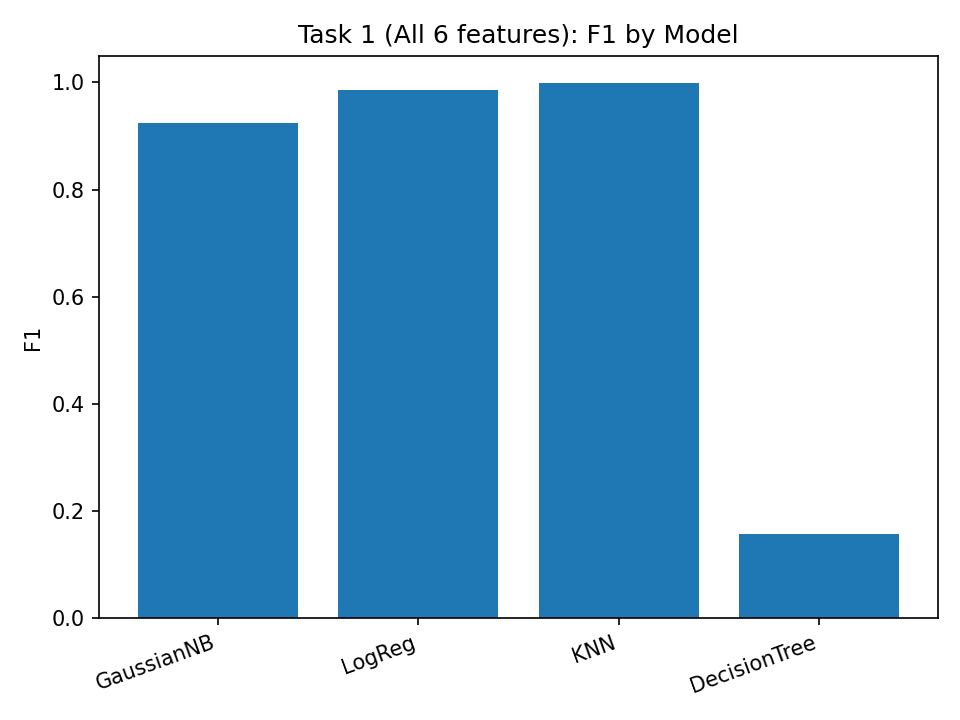
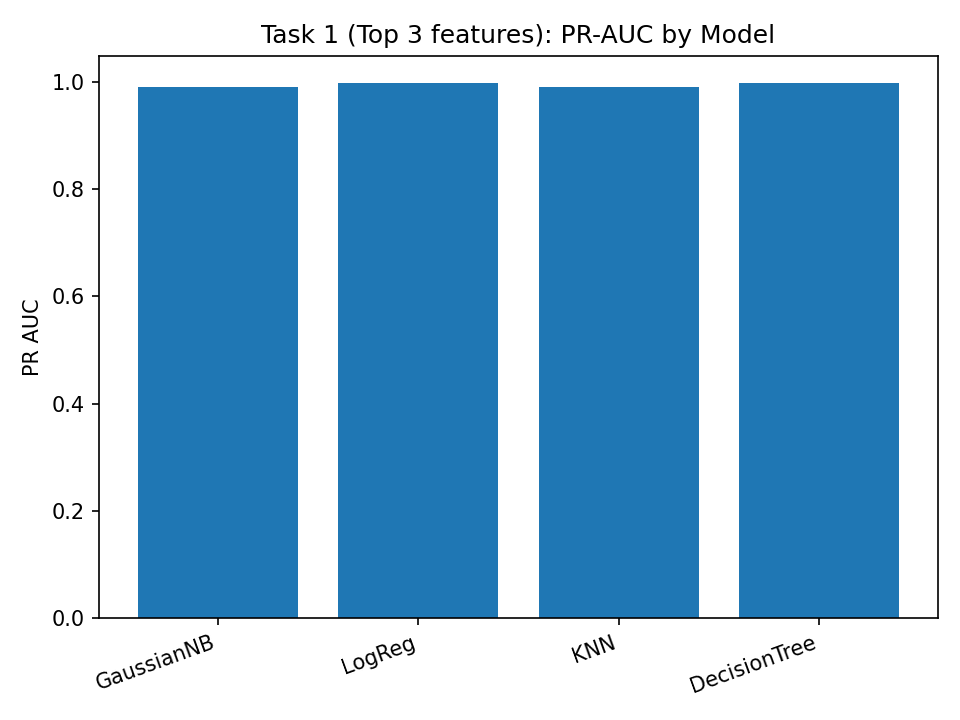
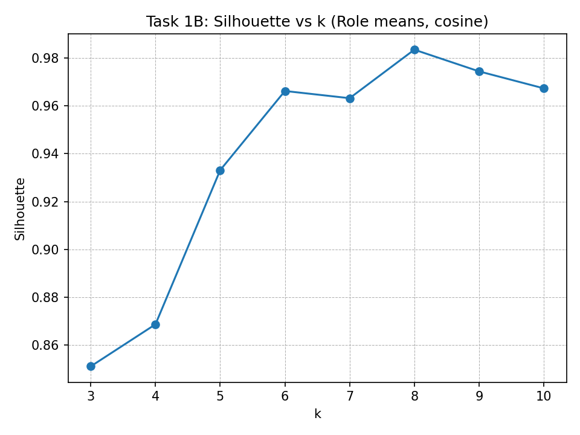

#  Trufflow Project Brief
**Milestones 1 & 2 Summary**  
*Team Trufflow 1B — AI Studio Fellowship Project*  
Tools: **NumPy, scikit-learn, toolz, transformers** License: Apache 2.0

## 🚀 Project Overview
The Trufflow project analyzes structured **app-to-app transaction data** to:
1. Detect and prioritize **anomalous behavior**;
2. Map **service similarity** for consolidation and investigation.

Both milestones build the foundation for an intelligent anomaly-detection pipeline that can later be automated and scaled.

##  Milestone 1 — Baseline Analysis & EDA
### Goal
Understand the dataset, identify key features, and train a **baseline** to detect anomalies.

### Key Results (headline)
| Metric | Value |
|:--|:--:|
| PR-AUC | 0.931 |
| F1-Score | 0.879 |
| Accuracy | 0.947 |

##  Milestone 2 — Model Training, Comparison & Refinement
### Task 1 — Baseline vs Contenders (Anomaly Detection)
We trained **Naive Bayes, Logistic Regression, KNN, Decision Tree** on two feature sets (All 6, Top 3) and evaluated on a 20% time-based validation split.

**Best contender:**
- **Model:** KNN  
- **PR-AUC:** 1  
- **F1:** 0.9994  
- **Accuracy:** 0.9999

### Figures — Task 1 (saved)

### Baseline (3-feature GaussianNB) — Confusion & Metrics
| Metric | Value |
|:--|:--:|
| Threshold | 0.9806 |
| PR-AUC | 0.9775 |
| Accuracy | 0.9867 |
| Precision | 0.9028 |
| Recall | 0.9452 |
| F1 | 0.9235 |
| Confusion (valid) | **TN=279230  FP=2660  FN=1433  TP=24712** |

### Task 1B — Service Similarity & Clustering
We built cosine-based service similarities (role vectors), PCA(3) neighbors, and ran KMeans/Agglomerative clustering. Best separation around **k=8** (Silhouette ≈ 0.98).
### Figure — Task 1B (saved)

### Task 3 — Feature Refinement
We tuned **KNN** (k ∈ {3..15}) and **LogReg** (C ∈ {0.1..10}) on the Top-3 features. KNN k=15 achieved F1≈0.9943 with stable high accuracy.

### Task 4 — Docs & Visuals
Created **Milestone2_Final_Report.md**, updated **README.md**, and saved all figures so the workflow is easy to follow.

### Task 5 — Bonus Investigation
Planned next steps: temporal features (rolling windows), Isolation Forest / Autoencoder for unsupervised anomalies, and graph embeddings for service-network effects.

##  Milestone 1 vs Milestone 2 — Side-by-Side
| Metric | Milestone 1 (Baseline) | Milestone 2 (Best) |
|:--|--:|--:|
| PR-AUC | 0.931 | 1 |
| F1 | 0.879 | 0.9994 |
| Accuracy | 0.947 | 0.9999 |

## Final Takeaway
- **KNN** emerged as the strongest model with near-perfect precision and recall.
- Clustering produced clear service groups to monitor.
- Documentation and visuals make the solution easy to explain and extend.
- Next: add temporal + graph features and evaluate unsupervised anomaly models.

