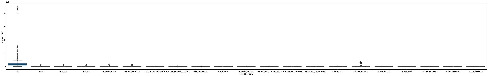
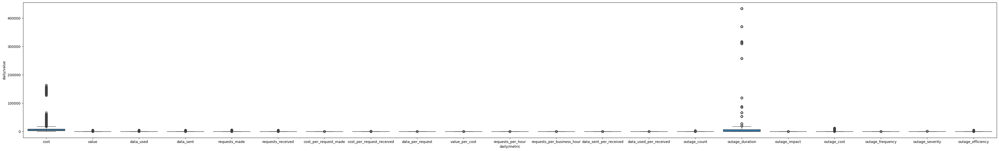
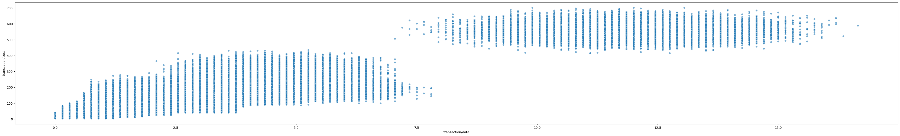
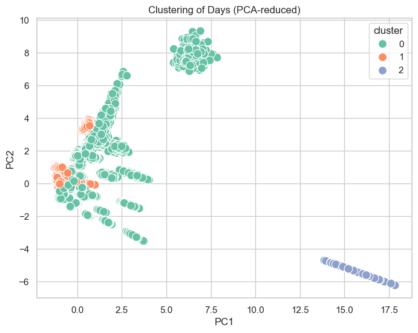

# Trufflow-Breakthrough-Task1

Exploratory Data Analysis (EDA) - Ira Dharia

- For this part I previewed the tables for transactions, daily, and monthly using pandas and matplotlib + seaborn. There are no null values or duplicate rows as far as I can tell with my analysis. I visualized the relationship between transactions/data (x) and transactions/cost (y) in a scatterplot. For daily and monthly metrics I visualized the relationship between x='daily/metric', y='daily/value' in a boxplot which shows that "outage duration" and "cost" were the highest value.

Feature Engineering (FE) - Sydni Yang

- For the second part, I performed feature engineering on the transactions, daily metrics, and monthly metrics datasets. I pivoted the datasets to a wide format and renamed columns to standard labels (req_count, cost_sum, data_sum, cost_mean, and data). I cleaned the datasets by dropping constant and duplicate columns. I selected the best core features based on correlation, with cost_sum for transactions and req_count, cost_sum, and cost_mean for daily and monthly metrics. After feature engineering, the datasets were shaped and cleaned (values can be shown in the file).  

## Milestone 1 Report - Trufflow 1A

Tools used:

- Jupyter Notebooks - Python
  - NumPy
  - Scikit-Learn
    - GaussianNB
    - LogisticRegression
    - various metrics, ie auc, precision_recall_curve, f1_score, etc.
  - pandas
  - Matplotlib
  - Seaborn

Baseline classifier: Naïve Bayes

Similarity: cosine k-means clustering

### Data Overview

We used Trufflow's transactional data to:

- Detect and prioritize anomalous behavior by considering outliers
- Cluster services by similarity

The datasets given to us:

- transactions.jsonl - per-transaction records with times, consumer/supplier IDs/names, costs, data volume, response outcomes, and transaction IDs
  - Number of observations: 7254656 (originally), 5186279 (cleaned)
  - Number of variables: 10 (originally), 7 cleaned
- daily_metrics.jsonl - per-app daily summaries with times, names, IDs, input time for value count
  - Number of observations: 666855 (originally), 63510 (cleaned)
  - Number of variables: 7 (originally), 23 (cleaned)
- monthly_metrics.jsonl - per-app monthly summaries with times, names, IDs, input time for value count
  - Number of observations: 18270 (originally), 870 (cleaned)
  - Number of variables: 7 (originally), 20 (cleaned)

The dataset includes numeric and non-numeric data, such as names and reasonings. We downloaded the dataset to use locally because of size complications, and it was already in tidy format and cleaned. We did not find any duplicate or null values, and the number of observations only changed since while we kept all observations, we aggregated them by "monthly/metric", "daily/metric", "transaction/data", and "transaction/cost" to reduce some redundancies. This added to the number of variables, and we had also removed some constant/ no-variance columns and exact-duplicate columns. We renamed these columns to have a clearer and more standard labeling with \[req_count, cost_sum, data_sum, cost_mean, and data\]

### EDA & Feature Engineering

In this section, we created separate dataframes for the different datasets, visualizing the data with scatterplots and boxplots.

From the boxplots, we first looked at the "monthly_metrics" data where we found that there is a large range of data for "cost" when looking at "monthly/metric" against "monthly/value", with a lot of outliers.

We then looked at the "daily_metrics" data, with "daily/metric" vs "daily/value", where we found that "cost" had a large variability again, but so did "outage_duration," both having many outliers as well.

Finally, when looking at the "transactions" data, we implemented a scatterplot with "transaction/data" against "transaction/cost." This gave us two separate groups of data, \[0, 7.5\] and \[7.5, 15\], and while we saw that this gives the features a positive correlation, we also saw that they can be further grouped to \[0, 400\] and \[400, 700\] respectively by looking at "transaction/cost".

Working on the features, by pivoting, we were able to create 18 more for both "daily_metrics" and "monthly_metrics," and we were able to drop 2 from "transactions". We were able to further engineer some features as well by normalizing our totals, applying logarithmic transformations, and/or looking at time series lags.

For all three of the datasets, we discovered that there is high positive correlation between "cost_sum" and "data_sum," with "cost_sum" being marked as one of the best features for each of them as well. In "daily_metrics" and "monthly_metrics", we found that "req_count" and "cost_mean" were also best features based on correlation. In every dataset, we dropped "tenant/id" for being constant (they were all 'DEMO'), and from "daily_metrics" and "monthly_metrics" we also dropped "value" since it had duplicate data. We dropped others as well, but these were the ones that showed trends through the datasets.

### Modeling

We sorted our daily_features dataset by time and marked the top 2% of "cost_sum" as anomalous. We then split the data into training and test sets to create Gaussian Naive Bayes models with all 6 features and 3 features, and a Logistic Regression classifier with 3 features. Below are the metrics for the quality of the decision models, showing that the logistic regression model seems to be the best overall, with the highest F1 and accuracy stats and good recall. The best recall would be attributed to the Gaussian Naive Bayes models though, so we would value it more as we are focused on tracking anomalies and false negatives could be detrimental for the company.

| Model | PR-AUC | AP  | Precision | Recall | F1  | Accuracy |
| --- | --- | --- | --- | --- | --- | --- |
| GNB-1f | 0.980345 | 0.980412 | 0.572549 | 1.000000 | 0.728180 | 0.982837 |
| GNB-3f | 0.980345 | 0.980412 | 0.572549 | 1.000000 | 0.728180 | 0.982837 |
| LogReg-3f | 0.980345 | 0.980412 | 0.941606 | 0.883562 | 0.911661 | 0.996064 |

Based on the Gaussian Naive Bayes model, we were able to find the top 10 anomalous transactions based on "cost_sum" and "date" (below).

|     | date | consumer | supplier | cost_sum |
| --- | --- | --- | --- | --- |
| 6091391 | 2025-04-03 | Mercury Customer Portal | Mercury Customer Service Chatbot | 684.75 |
| 6045920 | 2025-03-31 | Mercury Customer Portal | Mercury Customer Service Chatbot | 676.45 |
| 6119529 | 2025-04-04 | Mecury eCommerce Platform | Mercury Customer Service Chatbot | 672.30 |
| 6046318 | 2025-03-31 | Mercury Mobile App | Mercury Customer Service Chatbot | 672.30 |
| 6203401 | 2025-04-08 | Mercury Customer Portal | Mercury Customer Service Chatbot | 655.70 |
| 6206677 | 2025-04-08 | Mecury eCommerce Platform | Mercury Customer Service Chatbot | 655.70 |
| 6190435 | 2025-04-08 | Mecury eCommerce Platform | Mercury Customer Service Chatbot | 651.55 |
| 6162144 | 2025-04-06 | Mecury eCommerce Platform | Mercury Customer Service Chatbot | 651.55 |
| 7217765 | 2025-05-30 | Mercury Customer Portal | Mercury Customer Service Chatbot | 651.55 |
| 6170088 | 2025-04-07 | Mecury eCommerce Platform | Mercury Customer Service Chatbot | 647.40 |

### Clustering

Below is the graph we created based on a 3-means clustering that was PCA-reduced, showing that cluster 1 slightly overlaps with cluster 0 in the -2.5 to 2.5 range with PC1, and with PC2, overlapping around -1 to 4.

Below is a table for the summary of the features based on the k-means clustering.

| cluster | requests_made | cost | value | data_used | data_sent | cost_per_request_made | cost_per_request_received | data_per_request | data_sent_per_received | data_used_per_received |
| --- | --- | --- | --- | --- | --- | --- | --- | --- | --- | --- |
| 0   | 207.796493 | 7755.987210 | 208.683799 | 133.972376 | 208.683799 | 39.899386 | 89.228991 | 0.698134 | 1.217081 | 1.743496 |
| 1   | 85.138140 | 9368.376057 | 4.193110 | 197.442333 | 4.193110 | 106.524119 | 12.891830 | 2.253433 | 0.193480 | 0.193480 |
| 2   | 4946.383562 | 143694.386712 | 4204.578493 | 4204.578493 | 4204.578493 | 29.049613 | 87.148840 | 0.850043 | 2.550130 | 2.550130 |
